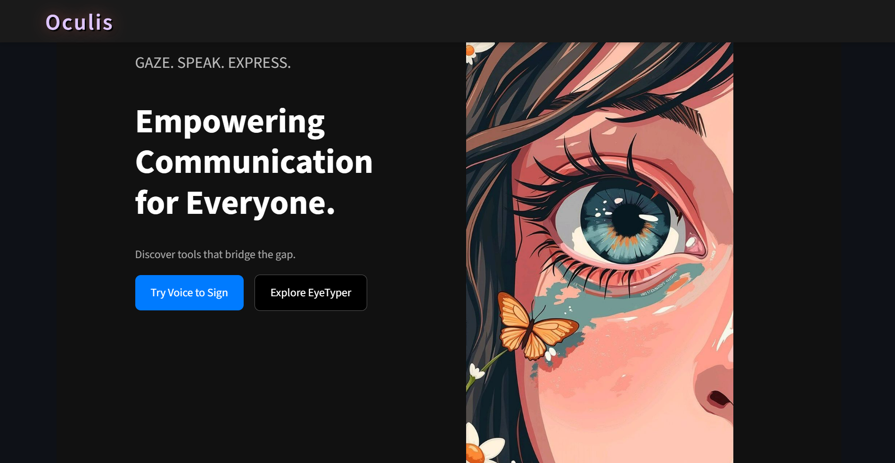
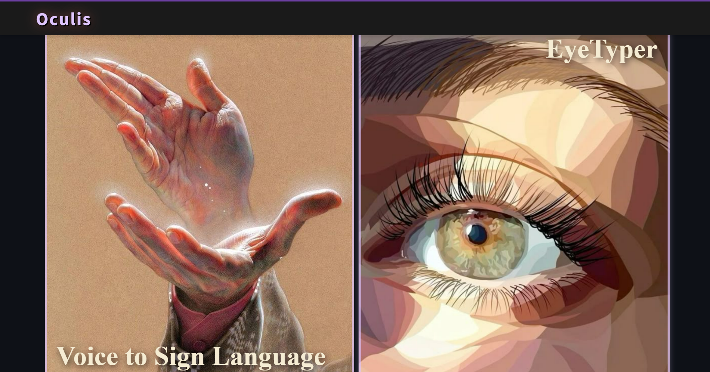

# 🧠 Oculis - AI-Powered Eye & Sign Language Typing Prototype

Oculis is a **Streamlit-based accessibility prototype** that enables users to **type using sign language gestures** and a **virtual eye-controlled keyboard**.  
It is a prototype of the **EyeTyper demo**, designed to help non-verbal users communicate effortlessly using **AI and computer vision**.

🌐 **Live Demo:** [oculis-ssaypsmxadpq3e4ikcvkdf.streamlit.app](https://oculis-ssaypsmxadpq3e4ikcvkdf.streamlit.app/)

---

## 🚀 Features

✅ **Sign Language Typing** — Converts sign gestures into text using computer vision.  
✅ **EyeTyper Keyboard** — Enables gaze-based typing for accessibility.  
✅ **Real-Time Feedback** — Displays recognized letters and words instantly.  
✅ **Minimal UI** — Clean Streamlit interface built for demonstration.  
✅ **Streamlit Deployment** — Hosted online for instant access.

---

## 🖼️ Screenshots

### 🧩 Home Interface  


### ✨ options 


### 🤟 Sign Language Typing Demo  


### 👁️ EyeTyper Keyboard  


> 📝 *To display the images above, create an `assets` folder in your repository and add your screenshots there with the same filenames.*

---

## 🧰 Tech Stack

| Category | Technology |
|-----------|-------------|
| **Frontend Framework** | [Streamlit](https://streamlit.io/) |
| **Programming Language** | Python |
| **AI/ML Integration** | OpenCV, MediaPipe |
| **Deployment** | Streamlit Cloud |
| **Prototype Base** | EyeTyper Accessibility Demo |

---

## ⚙️ How to Run Locally

```bash
# Clone this repository
git clone https://github.com/Sanskriti2305/Oculis.git

# Navigate to the folder
cd Oculis

# Install dependencies
pip install -r requirements.txt

# Run the Streamlit app
streamlit run app.py
